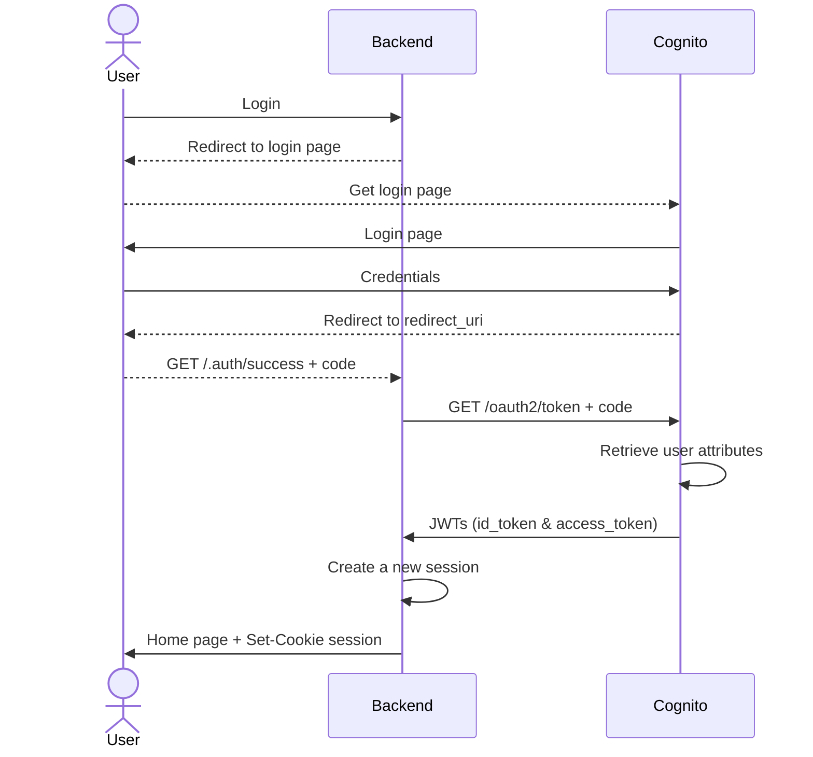

# Dev

## The client
React application, [refer to its dedicated doc](./client/README.md).

## The server
A native Golang HTTP static file server for the web files (html, css, js, ...) that can be templated.
It comes along with an API endpoints for metrics.

Exposes an endpoint `GET /api/me` to let any clients verify the current priviledges if needed. All the RBAC is done on this side anyways.

## The auth server
It is a mock for the cloud provider user base (like AWS Cognito) and is used to trade an authorisation code for JWTs to store in a user session.


## Dev in local

```bash
export UID
docker compose --profile local up --watch --build
```

## API tests in local

```bash
docker compose --profile api-tests up --build -d
cd server && go test ./api-tests
```

# Operations

## Deployment

It is relying on the gitops paradigm.
On the deployment host, a gitops agent watches for the `deploy-<env>` branch and will pull the docker image and restart the server appropriately.

# Authentication flow


