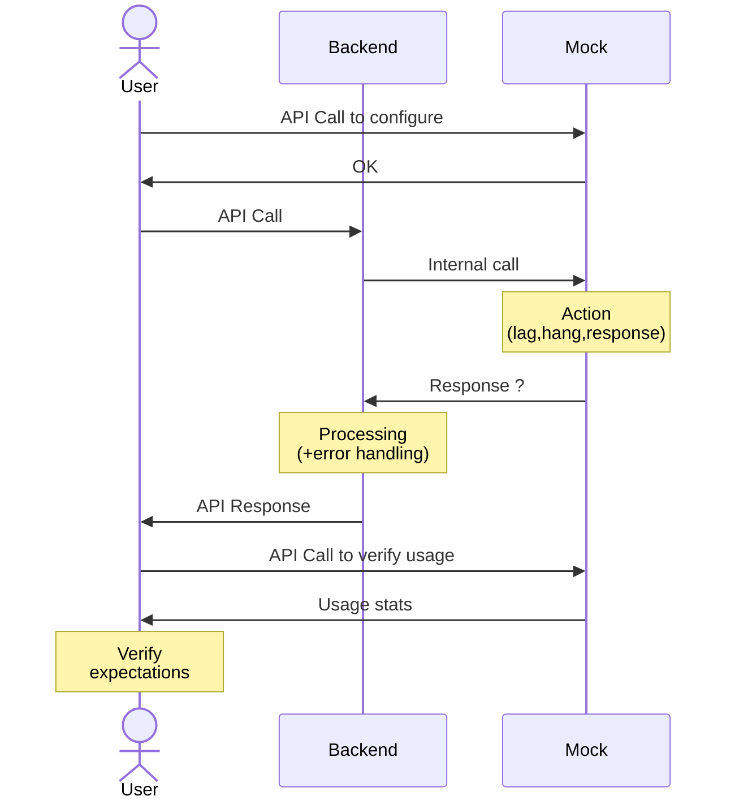

# Mock Server

API testing using a mock server

```mermaid
sequenceDiagram
    actor User
	participant Backend
	participant Mock
	User->>Mock: API Call to configure
	Mock->>User: OK
	User->>Backend: API Call
	Backend->>Mock: Internal call
	Note over Mock: Action<br/>(lag,hang,response)
	Mock->>Backend: Response ?
	Note over Backend: Processing<br/>(+error handling)
	Backend->>User: API Response
	User->>Mock: API Call to verify usage
	Mock->>User: Usage stats
	Note over User: Verify<br/>expectations
```